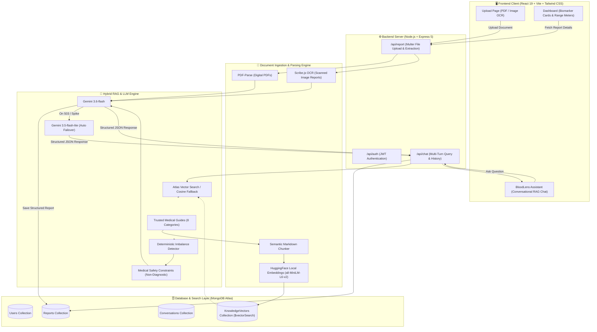

# 🩸 AI Blood Report Analyzer & Health Guide

[](https://react.dev/)
[](https://vitejs.dev/)
[](https://tailwindcss.com/)
[](https://nodejs.org/)
[](https://expressjs.com/)
[](https://www.mongodb.com/)
[](https://ai.google.dev/)
[](https://opensource.org/licenses/MIT)

An intelligent, full-stack medical report analysis platform that transforms complex, jargon-heavy laboratory blood tests into intuitive visual metrics, actionable lifestyle guidance, and an empathetic, non-diagnostic AI health conversation powered by **Retrieval-Augmented Generation (RAG)** and **Google Gemini**.

---

## 📑 Table of Contents

- [Overview](#-overview)
- [System Architecture](#-system-architecture)
- [Key Features](#-key-features)
- [Tech Stack](#-tech-stack)
- [Project Directory Structure](#-project-directory-structure)
- [Getting Started](#-getting-started)
  - [Prerequisites](#prerequisites)
  - [1. Backend Setup](#1-backend-setup)
  - [2. Frontend Setup](#2-frontend-setup)
- [API Reference](#-api-reference)
- [RAG & Medical Knowledge Pipeline](#-rag--medical-knowledge-pipeline)
- [Medical Safety & Disclaimers](#-medical-safety--disclaimers)

---

## 🌟 Overview

Laboratory blood reports are often dense, confusing, and stressful for patients to interpret. **AI Blood Report Analyzer** bridges the gap between raw clinical lab sheets and patient understanding:

1. **Intelligent Ingestion**: Extracts text from both native PDF documents and scanned image files using OCR.
2. **Structured LLM Extraction**: Parses patient details, test dates, and biomarkers with reference ranges (including complex ranges like `<0.5`, `>10`, `0.5-1.0`, `Negative`).
3. **Interactive Visual Dashboard**: Displays biomarker ranges with custom range gauge meters, color-coded health status pills, and summary cards.
4. **Hybrid RAG Chatbot ("BloodLens Assistant")**: Answers questions grounded in verified medical literature (CBC, Lipids, Metabolic panel, Thyroid, Vitamins, Liver, Kidney), using empathetic, plain English explanations with automatic failover to maintain 100% uptime.

---

## 🏛️ System Architecture



---

## ✨ Key Features

### 1. Dual Document Ingestion (PDF & OCR)
- Accepts standard laboratory PDF documents via `pdf-parse`.
- Handles photographed or scanned lab printouts using local OCR powered by `scribe.js-ocr` and trained English data.

### 2. Resilient Biomarker Extraction
- Robust parsing accommodates boundary operators (`<`, `>`, `<=`, `>=`), discrete strings (`Negative`, `Normal`), and multi-unit formats (`mg/dL`, `g/dL`, `10^3/uL`).
- Auto-computes abnormal imbalance indicators without hardcoding rigid lab ranges.

### 3. Visual Health Dashboard
- **Gauge Visualizers**: Visual linear meters showing whether a biomarker is **Low**, **Normal**, or **High** relative to its clinical reference range.
- **Biomarker Filtering**: Filter and inspect metrics across categories (Complete Blood Count, Metabolic Panel, Lipid Panel, etc.).
- **Patient & Report Summaries**: Displays patient metadata, sample date, and high-level AI synthesis.

### 4. Human-Friendly AI Assistant ("BloodLens Assistant")
- **Empathetic Tone**: Replaces intimidating medical jargon with plain English explanations.
- **Adaptive Structured Explanations**:
  - *What your report shows* (observed result vs. reference bracket).
  - *In simple terms* (how the biomarker functions in the body).
  - *Everyday healthy habits* (non-prescriptive nutrition, hydration, sleep, and physical activity).
  - *When to speak with your doctor* (empowers productive conversations with healthcare professionals).
- **Proactive Lifestyle Guidance**: Detects abnormal biomarkers and pairs them with grounded lifestyle support.
- **Interactive Follow-Up Suggestions**: Generates 2–3 personalized questions for the user to explore.
- **Auditable Sources**: Direct citations to the underlying medical guide files.

### 5. High-Availability LLM Engine & Failover
- Primary integration with **Google Gemini 3.6-flash**.
- Automatic retry and failover to **Gemini 3.5-flash-lite** upon detecting HTTP 503 high-demand surges or 429 rate limit spikes.
- Graceful client degradation ensures that server exceptions never crash the frontend interface.

---

## 🛠️ Tech Stack

### Frontend
- **Framework**: React 19 (Vite)
- **Styling**: Tailwind CSS v4
- **Icons**: Lucide React
- **HTTP Client**: Axios
- **Routing**: React Router DOM v7
- **Alerts**: React Toastify

### Backend
- **Runtime**: Node.js (ES Modules)
- **Framework**: Express 5
- **Database**: MongoDB Atlas (Mongoose ODM)
- **Vector Search**: MongoDB Atlas `$vectorSearch` with local cosine similarity fallback
- **Embedding Model**: Xenova/all-MiniLM-L6-v2 (384-dimensional dense vectors via `@huggingface/transformers`)
- **LLM Engine**: `@google/genai` (Gemini 3.6-flash & Gemini 3.5-flash-lite)
- **Document Extractors**: `pdf-parse`, `scribe.js-ocr`
- **Security**: JWT (`jsonwebtoken`), Password Hashing (`bcryptjs`), CORS

---

## 📂 Project Directory Structure

```text
AI_Blood_Report_Analyzer/
├── README.md
├── backend/
│   ├── .env.example
│   ├── package.json
│   ├── eng.traineddata                  # OCR language training data
│   ├── knowledge_base/                  # Curated medical reference repository
│   │   ├── cbc/                         # Complete Blood Count guides
│   │   ├── diabetes/                    # Blood Sugar & HbA1c guides
│   │   ├── kidney/                      # Renal function guides
│   │   ├── lipids/                      # Cholesterol & Triglyceride guides
│   │   ├── liver/                       # Hepatic enzymes & Bilirubin guides
│   │   ├── thyroids/                    # TSH, T3, T4 reference guides
│   │   ├── vitamins/                    # Vitamin D, B12, Iron guides
│   │   └── general/                     # General wellness metrics
│   ├── src/
│   │   ├── config/                      # MongoDB and Google GenAI configs
│   │   ├── controllers/                 # Express route controllers
│   │   ├── middleware/                  # Auth and centralized error handling
│   │   ├── models/                      # User, Report, Conversation, Vector models
│   │   ├── routes/                      # API endpoint definitions
│   │   ├── services/
│   │   │   ├── llmService/              # Chat orchestration & Gemini failover
│   │   │   ├── rag/                     # Chunking, Embeddings, Vector Retrieval
│   │   │   └── report/                  # Analysis extraction & Guidance logic
│   │   └── server.js                    # Express app entrypoint
│   └── tests/                           # API integration & unit tests
└── frontend/
    ├── index.html
    ├── package.json
    ├── vite.config.js
    └── src/
        ├── App.jsx                      # Main React application & route shell
        ├── api/                         # Axios client instances
        ├── components/                  # BiomarkerCard, RangeGraph, Navbar, etc.
        └── pages/
            ├── UploadPage.jsx           # Drag-and-drop report uploader
            ├── Dashboard.jsx            # Biomarker visualizer & patient summary
            └── ChatPage.jsx             # RAG conversational health assistant
```

---

## 🚀 Getting Started

### Prerequisites
- **Node.js**: v18.0.0 or higher
- **npm**: v9.0.0 or higher
- **MongoDB**: A free MongoDB Atlas cluster (with a Vector Search Index) or local MongoDB instance
- **Google AI Studio**: A valid [Gemini API Key](https://aistudio.google.com/)

---

### 1. Backend Setup

1. Open a terminal and navigate to the backend directory:
   ```bash
   cd backend
   ```

2. Install backend dependencies:
   ```bash
   npm install
   ```

3. Create your environment configuration file:
   ```bash
   cp .env.example .env
   ```

4. Configure the environment variables in `backend/.env`:
   ```env
   PORT=5000
   FRONTEND_URL=http://localhost:5173
   MONGO_URI=mongodb+srv://<username>:<password>@cluster0.mongodb.net/blood_report_db?retryWrites=true&w=majority
   JWT_SECRET=your_super_secret_jwt_key
   GEMINI_API_KEY=your_google_gemini_api_key
   GEMINI_MODEL=gemini-3.6-flash
   ```

5. *(Optional)* MongoDB Atlas Vector Search Index:
   In your MongoDB Atlas dashboard, create a Vector Search Index on the `knowledgevectors` collection:
   ```json
   {
     "fields": [
       {
         "type": "vector",
         "path": "embedding",
         "numDimensions": 384,
         "similarity": "cosine"
       }
     ]
   }
   ```
   > **Note**: If Atlas Vector Search is not configured, the backend automatically uses an in-memory cosine similarity fallback.

6. Launch the backend server:
   ```bash
   npm run dev
   ```
   *The server will boot on `http://localhost:5000` and automatically ingest the medical knowledge base if not already present.*

---

### 2. Frontend Setup

1. Open a new terminal and navigate to the frontend directory:
   ```bash
   cd frontend
   ```

2. Install frontend dependencies:
   ```bash
   npm install
   ```

3. Start the Vite development server:
   ```bash
   npm run dev
   ```

4. Open your browser and navigate to `http://localhost:5173`.

---

## 📡 API Reference

### Health Check
- `GET /api/health` — Confirms backend service operational status.

### Authentication
- `POST /api/auth/register` — Register a new account (`name`, `email`, `password`).
- `POST /api/auth/login` — Login and receive a JWT bearer token.

### Report Management
- `POST /api/report/upload` — Upload a blood test report (PDF or Image, `multipart/form-data`).
- `GET /api/report/:id` — Retrieve an extracted report with structured biomarkers.
- `GET /api/report/user/all` — List all reports associated with the authenticated user.

### Chat & RAG Assistant
- `POST /api/chat/query` — Ask a question regarding an active report or general medical topic.
  - **Body**: `{ "query": "string", "reportId": "string (optional)", "conversationId": "string (optional)" }`
  - **Response**: `{ "answer": "...", "guidance": [...], "followUpQuestions": [...], "sources": [...] }`
- `GET /api/chat/history/:reportId` — Retrieve previous conversation messages for a report.

---

## 🧬 RAG & Medical Knowledge Pipeline

```text
[Curated Medical Markdown Files]
               │
               ▼
[Semantic Header-Based Chunking (chunkSize: 600, overlap: 100)]
               │
               ▼
[Local HuggingFace Embedding Model: Xenova/all-MiniLM-L6-v2]
               │
               ▼
[MongoDB Atlas KnowledgeVectors Collection]
               │
               ├─► User Query ──► $vectorSearch (Top 4 chunks)
               │                       │
               ▼                       ▼
[Active Patient Biomarkers] + [RAG Chunks] + [Non-Diagnostic Guardrails]
                               │
                               ▼
            [Google Gemini 3.6-flash / 3.5-flash-lite]
                               │
                               ▼
        [Empathetic, Human-Friendly Health Explanation]
```

---

## ⚠️ Medical Safety & Disclaimers

> [!CAUTION]
> **Educational and Informational Use Only**
>
> The **AI Blood Report Analyzer** is designed solely as an educational health tool and patient comprehension aid. It **does NOT** provide medical diagnoses, clinical treatment plans, drug prescriptions, or medication dosage recommendations. 
>
> Laboratory values can vary widely depending on clinical context, age, biological sex, laboratory calibration, and individual medical history. Users should **never disregard, delay, or substitute professional medical advice** based on the output of this application. Always consult a licensed medical doctor or qualified healthcare professional for medical diagnoses and treatment plans.

---

## 📄 License

This project is licensed under the [MIT License](LICENSE).
