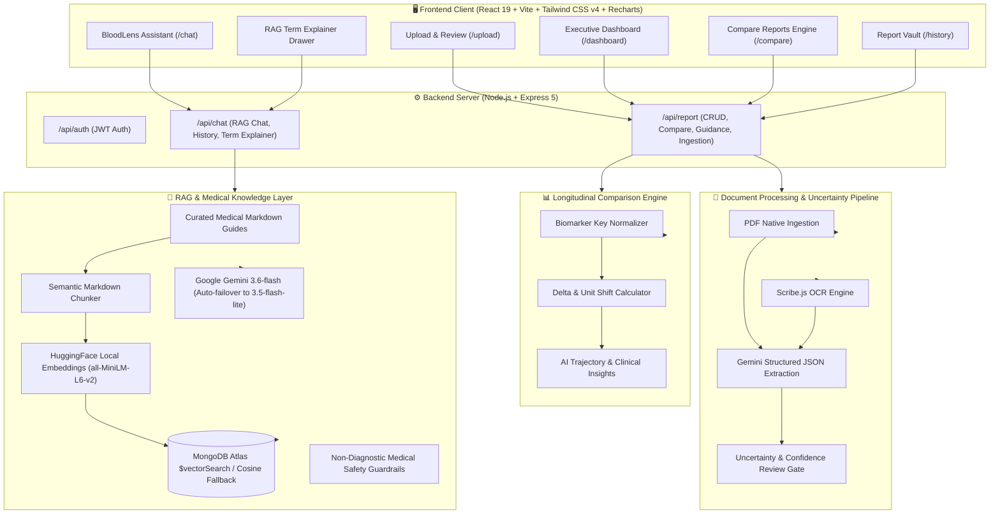

# 🩸 BloodLens — AI Blood Report Analyzer & Clinical Health Intelligence

[](https://react.dev/)
[](https://vitejs.dev/)
[](https://tailwindcss.com/)
[](https://recharts.org/)
[](https://nodejs.org/)
[](https://expressjs.com/)
[](https://www.mongodb.com/)
[](https://ai.google.dev/)
[](https://opensource.org/licenses/MIT)

**BloodLens** is a full-stack clinical health intelligence platform designed to transform complex, intimidating laboratory blood test reports into intuitive visual metrics, trading-style longitudinal trend graphs, and empathetic, evidence-grounded health literacy. Powered by **Retrieval-Augmented Generation (RAG)**, local dense vector embeddings, and **Google Gemini 3.6-flash**.

---

## 📑 Table of Contents

- [The 5 Core Pillars](#-the-5-core-pillars)
- [System Architecture](#-system-architecture)
- [Key Features](#-key-features)
- [Tech Stack](#-tech-stack)
- [Project Directory Structure](#-project-directory-structure)
- [API Reference](#-api-reference)
- [RAG & Medical Knowledge Pipeline](#-rag--medical-knowledge-pipeline)
- [Getting Started](#-getting-started)
  - [Prerequisites](#prerequisites)
  - [1. Backend Setup](#1-backend-setup)
  - [2. Frontend Setup](#2-frontend-setup)
- [Medical Safety & Disclaimers](#-medical-safety--disclaimers)

---

## 🏛️ The 5 Core Pillars

```
┌──────────────────────────────────────────────────────────────────────────────────┐
│                             BLOODLENS ARCHITECTURE                               │
├─────────────────┬─────────────────┬──────────────────┬─────────────────┬─────────┤
│    PILLAR 1     │    PILLAR 2     │     PILLAR 3     │    PILLAR 4     │PILLAR 5 │
│ Upload & Extract│ View & Explain  │  Compare Reports │ Changes & Habits│ Vault   │
│                 │                 │                  │                 │         │
│ • PDF Ingestion │ • Vitals Strip  │ • Multi-Date     │ • Trajectory AI │• PII    │
│ • Scribe OCR    │ • Range Gauges  │   Alignment      │ • Everyday      │  Masking│
│ • Confidence &  │ • RAG Medical   │ • Trading Ticker │   Physiological │• Session│
│   Uncertainty   │   Term Drawer   │   Style Charts   │   Factors       │  Storage│
│ • Review Table  │ • Literature    │ • Delta Matrix   │ • Doctor        │• Cascade│
│   Verification  │   Citations     │ • Unit Shift Alert  Checklist     │  Delete │
└─────────────────┴─────────────────┴──────────────────┴─────────────────┴─────────┘
```

### 1. Upload & Extract Reports
- **Dual Ingestion Engine**: Direct digital PDF parsing (`pdf-parse`) and scan/photo OCR extraction (`scribe.js-ocr` with trained English language data).
- **Extraction Review & Uncertainty Flagging**: Machine confidence scoring flags uncertain biomarkers (e.g. blurred text, ambiguous bounds) and presents an interactive verification table (`ExtractionReview.jsx`) for user corrections before saving.

### 2. View & Understand Results
- **Executive Health Dashboard**: Health overview vitals strip displaying total test count, normal range percentage, and attention-needed indicators.
- **Reference Range Gauges**: Visual target corridor gauges and color-coded status badges (**Normal**, **High**, **Low**).
- **RAG Medical Term Explainer Drawer**: Instant slide-over explainer (`BiomarkerExplainerDrawer.jsx`) providing non-diagnostic definitions, biological functions, and verified medical reference citations.

### 3. Compare Previous Reports
- **Deterministic Comparison Engine**: Automatic biomarker normalization (`getNormalizedBiomarkerKey()`) aligns tests across different report dates, identifying missing measurements, value changes, and unit/reference discrepancies.
- **Trading-Style Biomarker Trend Charts**: High-tech time-series graphs (`BiomarkerTrendChart.jsx` via `recharts`) featuring shaded clinical corridors, directional delta pills, and date-over-date percentage trajectories.

### 4. Understand Changes & Considerations
- **AI Trajectory Analysis**: Synthesizes multi-report trends in plain language, explaining how biological markers evolved between tests.
- **Everyday Physiological Factors**: Highlights non-pathological influences that cause transient fluctuations (hydration, fasting state, sleep, stress, recent exercise).
- **Doctor Discussion Checklist**: Generates personalized, copyable clinical consultation questions (`ComparativeInsightsView.jsx`) to facilitate productive discussions with primary care physicians.

### 5. Manage History & Privacy
- **Encrypted Document Vault**: Complete report history view (`ReportHistoryPage.jsx`) supporting registered users and guest sessions via `localStorage`.
- **Full Data Deletion**: Immediate cascade deletion removing reports, extracted biomarkers, and conversation histories (`DELETE /api/report/:id`).
- **PII Privacy Masking**: Global toggle instantly masks sensitive patient details on screen (`•••••••`) during live presentations or shared screens.

---

## 📐 System Architecture



---

## 🛠️ Tech Stack

| Domain | Technology | Description |
| :--- | :--- | :--- |
| **Frontend Framework** | React 19 + Vite 8 | Fast, modern client runtime with component modularity |
| **Styling & Theme** | Tailwind CSS v4 + Custom Tokens | Modern mesh gradients, glassmorphism, and micro-animations |
| **Visual Charts** | Recharts 2.15 | Trading-style time-series charts with shaded normal corridors |
| **Icons & Alerts** | Lucide React + React Toastify | Clean iconography and non-intrusive notification toasts |
| **Backend Runtime** | Node.js 18+ (ES Modules) + Express 5 | High-performance asynchronous REST API gateway |
| **Database & Vectors**| MongoDB Atlas + Mongoose ODM | Document storage with Atlas `$vectorSearch` and cosine fallback |
| **Local Embeddings** | Xenova/all-MiniLM-L6-v2 | 384-dimensional dense vectors generated locally without external API latency |
| **LLM Engine** | `@google/genai` (Gemini 3.6-flash) | Primary LLM with automatic failover to `gemini-3.5-flash-lite` |
| **Document OCR** | `pdf-parse` + `scribe.js-ocr` | Dual native PDF and scanned image text extraction |
| **Security & Auth** | JWT (`jsonwebtoken`) + `bcryptjs` | Stateless authentication and password hashing |

---

## 📡 API Reference

### 📄 Reports & Extraction
| Method | Endpoint | Description |
| :--- | :--- | :--- |
| `POST` | `/api/report/upload` | Upload PDF or image report (`multipart/form-data`) |
| `GET` | `/api/report/:id` | Fetch extracted report details, biomarkers, and ranges |
| `PUT` | `/api/report/:id` | Update/verify extracted biomarkers after review |
| `DELETE` | `/api/report/:id` | Delete report with cascading conversation removal |
| `POST` | `/api/report/batch` | Batch fetch multiple reports for guest sessions (`ids: []`) |
| `GET` | `/api/report/user/all` | List all saved reports for the authenticated user |
| `GET` | `/api/report/:id/guidance` | Retrieve proactive health & lifestyle guidance |

### 📊 Longitudinal Comparison
| Method | Endpoint | Description |
| :--- | :--- | :--- |
| `POST` | `/api/report/compare` | Compute deterministic biomarker delta matrix & unit shifts |
| `POST` | `/api/report/compare/insights`| Generate AI trajectory analysis & doctor checklist |

### 💬 Chat, RAG & Term Explainer
| Method | Endpoint | Description |
| :--- | :--- | :--- |
| `POST` | `/api/chat/query` | Conversational RAG assistant with report grounding |
| `GET` | `/api/chat/history/:reportId` | Fetch message history for a specific report |
| `GET` | `/api/chat/explain/:term` | Instant RAG term definition with medical citations |
| `POST` | `/api/chat/explain` | Context-aware biomarker term explainer (POST payload) |

### 🔐 Authentication
| Method | Endpoint | Description |
| :--- | :--- | :--- |
| `POST` | `/api/auth/register` | Register a new user (`name`, `email`, `password`) |
| `POST` | `/api/auth/login` | Login and receive a JWT bearer token |

---

## 🧬 RAG & Medical Knowledge Pipeline

```text
[8 Curated Medical Reference Topics]
 (CBC, Diabetes/Glucose, Lipids, Kidney, Liver, Thyroid, Vitamins, General)
               │
               ▼
[Semantic Header-Based Chunker (chunkSize: 600, overlap: 100)]
               │
               ▼
[Local HuggingFace Embedding Model: all-MiniLM-L6-v2 (384-dim)]
               │
               ▼
[MongoDB Atlas KnowledgeVectors Collection]
               │
               ├─► User Query / Explainer Term ──► Vector Search (Top 4 chunks)
               │                                      │
               ▼                                      ▼
[Active Biomarker Values] + [Reference Corridors] + [Medical Guides]
                               │
                               ▼
             [Google Gemini 3.6-flash / 3.5-flash-lite]
                               │
                               ▼
     [Empathetic, Non-Diagnostic Explanation with Literature Citations]
```

---

## 🚀 Getting Started

### Prerequisites
- **Node.js**: v18.0.0 or higher
- **npm**: v9.0.0 or higher
- **MongoDB**: MongoDB Atlas cluster (with a Vector Search index) or local instance
- **Google AI Studio**: A valid [Gemini API Key](https://aistudio.google.com/)

---

### 1. Backend Setup

1. Navigate to the backend directory:
   ```bash
   cd backend
   ```

2. Install dependencies:
   ```bash
   npm install
   ```

3. Create the `.env` file:
   ```bash
   cp .env.example .env
   ```

4. Configure environment variables in `backend/.env`:
   ```env
   PORT=5000
   FRONTEND_URL=http://localhost:5173
   MONGO_URI=mongodb+srv://<username>:<password>@cluster0.mongodb.net/blood_report_db?retryWrites=true&w=majority
   JWT_SECRET=your_super_secret_jwt_key
   GEMINI_API_KEY=your_google_gemini_api_key
   GEMINI_MODEL=gemini-3.6-flash
   ```

5. *(Optional)* MongoDB Atlas Vector Search Index:
   Create an index named `vector_index` on the `knowledgevectors` collection:
   ```json
   {
     "fields": [
       {
         "type": "vector",
         "path": "embedding",
         "numDimensions": 384,
         "similarity": "cosine"
       }
     ]
   }
   ```
   > **Note**: If Atlas Vector Search is not configured, the backend automatically uses an in-memory cosine similarity fallback.

6. Start the server:
   ```bash
   npm run dev
   ```
   *The server runs on `http://localhost:5000` and automatically ingests the medical knowledge base on startup.*

---

### 2. Frontend Setup

1. Navigate to the frontend directory:
   ```bash
   cd frontend
   ```

2. Install dependencies:
   ```bash
   npm install
   ```

3. Start the Vite dev server:
   ```bash
   npm run dev
   ```

4. Open your browser at `http://localhost:5173`.

---

## ⚠️ Medical Safety & Disclaimers

> [!CAUTION]
> **Educational and Informational Use Only**
>
> The **BloodLens** platform is designed strictly as an educational health literacy aid. It **does NOT** provide medical diagnoses, clinical treatment protocols, medication prescriptions, or dosage suggestions.
>
> Laboratory values vary across testing facilities, patient age, biological sex, instrument calibration, and clinical history. Users should **never disregard, delay, or substitute professional medical advice** based on application outputs. Always consult a licensed physician or certified healthcare provider for clinical evaluation.

---

## 📄 License

This project is licensed under the [MIT License](LICENSE).
